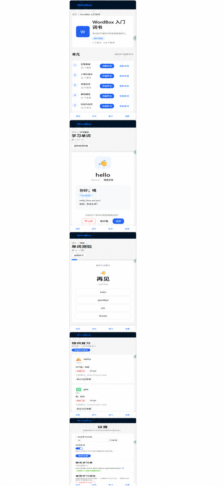

# WordBox

WordBox 是一个移动端适配的轻量背单词网站，当前处于 MVP 初始化阶段。

## 界面预览



## 项目结构

```text
WordBox/
├─ apps/
│  ├─ web/                 # Vite + React + TypeScript
│  └─ api/                 # NestJS + TypeScript
├─ data/                   # 初始单词数据（后续添加）
├─ TODO.md
└─ package.json            # npm workspaces 根配置
```

## 开发环境

- Node.js 20+
- npm 10+
- PostgreSQL（数据库阶段再启用）

## 常用命令

```bash
npm install
npm run dev
npm run dev:web
npm run dev:api
npm run test
npm run build
```

前端默认地址：http://localhost:5173

后端默认地址：http://localhost:3000

健康检查：http://localhost:3000/api/v1/health

Swagger UI：http://localhost:3000/api/docs

## 数据库命令

```bash
docker compose up -d
pnpm db:generate
pnpm db:migrate
pnpm db:seed
```

本地 PostgreSQL 默认连接地址由 `.env` 配置；停止数据库容器可以运行 `docker compose down`。

## 当前状态

阶段 1 已完成基础工程和代码质量配置，阶段 2 已完成 PostgreSQL、Prisma Schema、首次 migration 和可重复 seed。词书数据和学习闭环将在后续阶段实现，详见 [TODO.md](./TODO.md)。
